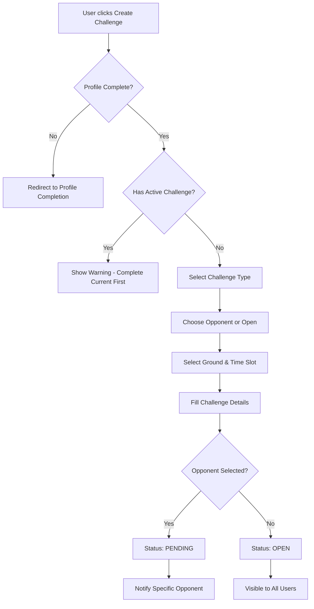
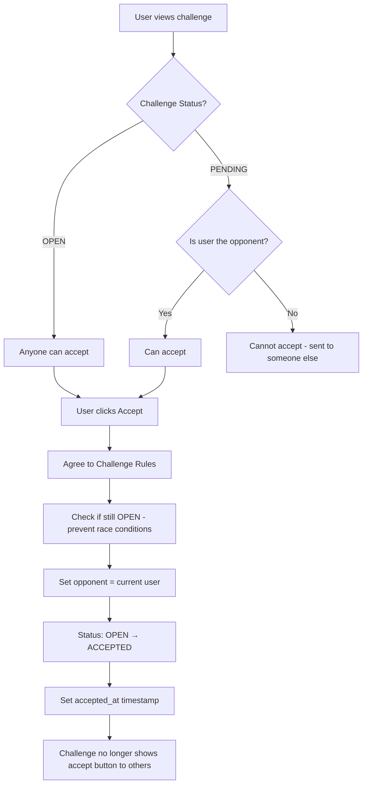

# Challenge Status & Workflow Documentation

## 🏏 Challenge Status System Implementation

### **Status States and Definitions**

The challenge system implements **5 distinct status states**:

1. **OPEN** - Available for acceptance by any user
2. **PENDING** - Sent to a specific opponent, waiting for their response  
3. **ACCEPTED** - Both players have committed to the challenge
4. **COMPLETED** - Match finished with results recorded
5. **CANCELLED** - Challenge cancelled by creator or system

### **Challenge Types**

The system supports **3 challenge types**:

1. **SINGLE_WICKET** - Team-based challenge with 4 participants (2 teams of batter + bowler)
2. **BATTING** - Individual batting performance challenge
3. **BOWLING** - Individual bowling performance challenge

## 🔄 Complete Challenge Workflow

### **1. Challenge Creation Workflow**



### **2. Challenge Acceptance Workflow**

#### **For Regular Challenges (BATTING/BOWLING):**


#### **For Single Wicket Challenges:**
```mermaid
graph TD
    A[User views Single Wicket challenge] --> B{Is user a participant?}
    B -->|No| C[Show "Not Involved" message]
    B -->|Yes| D[User can accept their role]
    D --> E[Mark specific role as accepted]
    E --> F{All 4 participants accepted?}
    F -->|No| G[Status remains OPEN/PENDING]
    F -->|Yes| H[Status: ACCEPTED]
    H --> I[All participants committed]
```

### **3. Status Transition Logic**

#### **Creation Transitions:**
- **No opponent selected** → Status: `OPEN`
- **Specific opponent selected** → Status: `PENDING`

#### **Acceptance Transitions:**
- **Regular challenges:** `OPEN/PENDING` → `ACCEPTED` (immediate)
- **Single Wicket:** `OPEN/PENDING` → `ACCEPTED` (when all 4 participants accept)

#### **Completion Transitions:**
- **Admin updates results** → Status: `COMPLETED`
- **Admin selects winner** → Status: `COMPLETED` + `completed_at` timestamp

### **4. "Open to All" Challenge Behavior**

#### **Key Features:**
1. **Visibility:** Shows to all users on the site
2. **First-Come-First-Served:** Only the first person to accept becomes the opponent
3. **Status Change:** Immediately changes from `OPEN` to `ACCEPTED` when accepted
4. **UI Update:** Accept button disappears for all other users once accepted
5. **Race Condition Protection:** Double-check status before accepting to prevent conflicts

#### **User Experience Flow:**
```
1. User creates "Open to All" challenge → Status: OPEN
2. Challenge appears in list for all users
3. Multiple users can see "Accept Challenge" button
4. First user clicks accept → Status: OPEN → ACCEPTED
5. Opponent is set to the accepting user
6. All other users see "Challenge Accepted" (no accept button)
7. Challenge is now between challenger and the first acceptor
```

## 🎯 Key Implementation Features

### **1. Participant Management**

#### **Regular Challenges:**
- **Challenger:** User who creates the challenge
- **Opponent:** User who accepts (can be specific or open)

#### **Single Wicket Challenges:**
- **Team 1:** `team1_batter` + `team1_bowler`
- **Team 2:** `team2_batter` + `team2_bowler`
- **Acceptance tracking:** Individual boolean fields for each role

### **2. Acceptance Validation**

```python
def all_participants_accepted(self):
    """Check if all participants have accepted the challenge"""
    if self.challenge_type == 'SINGLE_WICKET':
        return (self.team1_batter_accepted and 
                self.team1_bowler_accepted and 
                self.team2_batter_accepted and 
                self.team2_bowler_accepted)
    else:
        return self.status == 'ACCEPTED'
```

### **3. Permission System**

#### **Challenge Creation:**
- Must be authenticated
- Profile must be complete
- Cannot have active challenges (one at a time)

#### **Challenge Acceptance:**
- **OPEN challenges:** Anyone except challenger
- **PENDING challenges:** Only the specific opponent
- **Single Wicket:** Only assigned participants

#### **Challenge Management:**
- **Edit/Delete:** Only creator, only if status is `OPEN` or `PENDING`
- **Admin controls:** Staff members can update results and select winners

### **4. UI/UX Implementation**

#### **Status Display:**
- **Color-coded badges** for each status
- **Icons** representing current state
- **Dynamic action buttons** based on user permissions

#### **Acceptance Flow:**
- **Confirmation page** with challenge details
- **Rules agreement** checkbox (required)
- **Warning messages** about commitment
- **Success/error feedback**

#### **Template Structure:**
- **Challenge list:** Filterable by status
- **Challenge detail:** Comprehensive view with all information
- **Accept confirmation:** Step-by-step acceptance process

### **5. Data Model Architecture**

#### **Core Fields:**
```python
class Challenge(models.Model):
    # Participants
    challenger = models.ForeignKey(User, ...)
    opponent = models.ForeignKey(User, ...)
    winner = models.ForeignKey(User, ...)
    
    # Single Wicket participants
    team1_batter = models.ForeignKey(User, ...)
    team1_bowler = models.ForeignKey(User, ...)
    team2_batter = models.ForeignKey(User, ...)
    team2_bowler = models.ForeignKey(User, ...)
    
    # Acceptance tracking
    team1_batter_accepted = models.BooleanField(default=False)
    team1_bowler_accepted = models.BooleanField(default=False)
    team2_batter_accepted = models.BooleanField(default=False)
    team2_bowler_accepted = models.BooleanField(default=False)
    
    # Challenge details
    challenge_type = models.CharField(choices=CHALLENGE_TYPE_CHOICES)
    status = models.CharField(choices=STATUS_CHOICES, default="OPEN")
    
    # Timestamps
    created_at = models.DateTimeField(auto_now_add=True)
    accepted_at = models.DateTimeField(null=True, blank=True)
    completed_at = models.DateTimeField(null=True, blank=True)
```

### **6. Admin Workflow**

#### **Result Management:**
1. **Update match results** (admin only)
2. **Select winner** (manual or automatic)
3. **Status transition** to `COMPLETED`
4. **Statistics update** via signals

#### **Automatic Winner Determination:**
```python
def determine_winner(self):
    """Determine winner based on challenge metric and target"""
    if self.challenge.challenge_type == 'SINGLE_WICKET':
        # Compare batter runs
        team1_runs = self.challenger_runs or 0
        team2_runs = self.opponent_runs or 0
        return self.challenge.team1_batter if team1_runs > team2_runs else self.challenge.team2_batter
    else:
        # Regular challenge logic with target comparison
        challenger_score = self.get_challenger_score() or 0
        opponent_score = self.get_opponent_score() or 0
        # Winner determination logic...
```

## 🔧 System Integration

### **Signal-Based Updates:**
- **Challenge completion** triggers user statistics updates
- **Profile statistics** automatically recalculated
- **Ranking changes** tracked and stored

### **Validation & Safety:**
- **Self-challenge prevention**
- **Active challenge limits** (one per user)
- **Profile completion requirements**
- **Status-based permission checks**

### **Error Handling:**
- **Comprehensive validation** at model and view levels
- **User-friendly error messages**
- **Graceful degradation** for edge cases

## 📋 Status Transition Matrix

| Current Status | Action | New Status | Conditions |
|----------------|--------|------------|------------|
| OPEN | Accept | ACCEPTED | User is not challenger |
| PENDING | Accept | ACCEPTED | User is the specific opponent |
| OPEN | Edit | OPEN | User is challenger |
| PENDING | Edit | PENDING | User is challenger |
| ACCEPTED | Admin Update Results | ACCEPTED | Admin only |
| ACCEPTED | Admin Select Winner | COMPLETED | Admin only |
| OPEN | Delete | DELETED | User is challenger |
| PENDING | Delete | DELETED | User is challenger |

## 🎮 User Experience Flow

### **For Challenge Creators:**
1. **Create Challenge** → Fill details → Choose opponent or open
2. **Status becomes OPEN/PENDING** → Wait for acceptance
3. **Challenge accepted** → Status becomes ACCEPTED
4. **Admin completes match** → Status becomes COMPLETED

### **For Challenge Acceptors:**
1. **Browse challenges** → Filter by status
2. **View challenge details** → Check requirements
3. **Accept challenge** → Agree to rules
4. **Status updates** → Challenge becomes ACCEPTED

### **For Admins:**
1. **Monitor challenges** → View all statuses
2. **Update results** → Enter match statistics
3. **Select winner** → Manual or automatic
4. **Complete challenge** → Status becomes COMPLETED

## 🔍 Technical Implementation Details

### **View Functions:**
- `challenges_list()` - List all challenges with filtering
- `challenge_detail()` - Show individual challenge details
- `challenge_accept()` - Handle challenge acceptance
- `challenge_create()` - Create new challenges
- `challenge_edit()` - Edit existing challenges
- `challenge_delete()` - Delete challenges
- `admin_update_match_result()` - Admin result management
- `admin_select_winner()` - Admin winner selection

### **Model Methods:**
- `get_participants()` - Get all challenge participants
- `all_participants_accepted()` - Check if all participants accepted
- `get_participant_acceptance_status()` - Get acceptance status for all participants
- `clean()` - Model validation

### **Template Components:**
- `challenges/list.html` - Challenge listing with filters
- `challenges/detail.html` - Comprehensive challenge view
- `challenges/accept_confirm.html` - Acceptance confirmation
- `challenges/create.html` - Challenge creation form

## 🚀 Future Enhancements

### **Potential Improvements:**
1. **Notification system** for status changes
2. **Challenge expiration** for old challenges
3. **Bulk operations** for admin management
4. **Challenge templates** for common setups
5. **Mobile app integration** for real-time updates

### **Performance Optimizations:**
1. **Database indexing** on status and participant fields
2. **Caching** for frequently accessed challenges
3. **Pagination** for large challenge lists
4. **Async processing** for statistics updates

---

*This documentation provides a comprehensive overview of the challenge status and workflow system implementation in ChallengeHub. For technical details, refer to the source code in `tampere_cricket/matches/models.py` and `tampere_cricket/matches/views.py`.*
