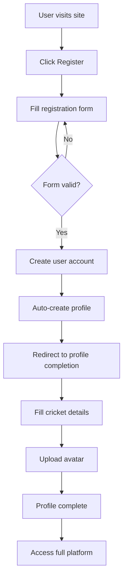
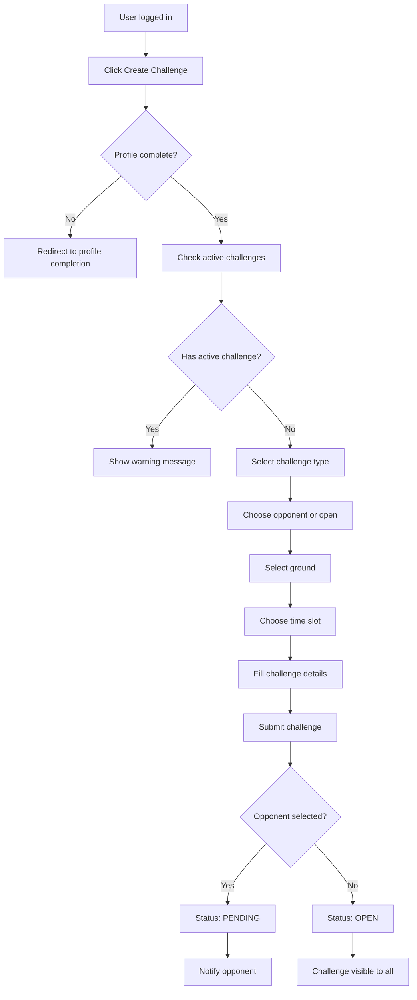
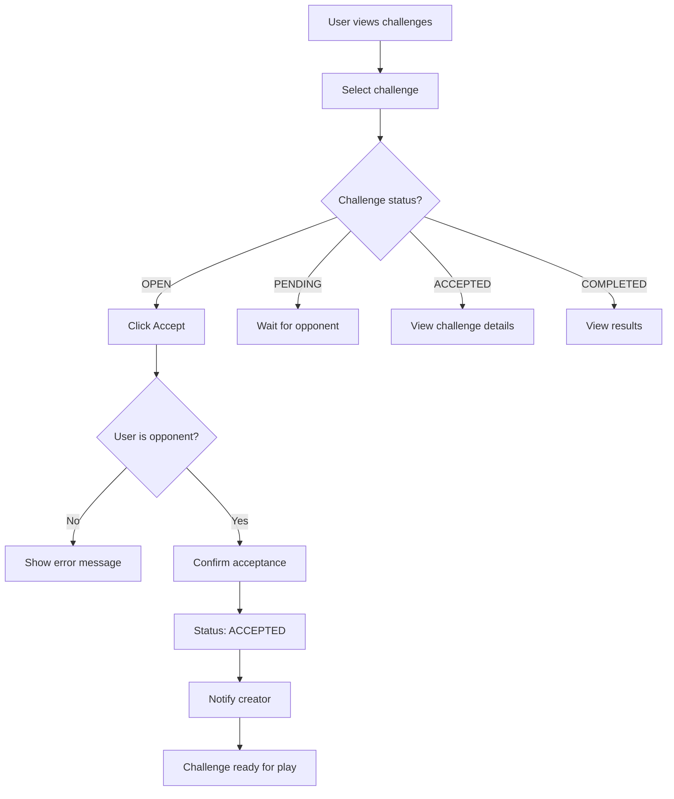
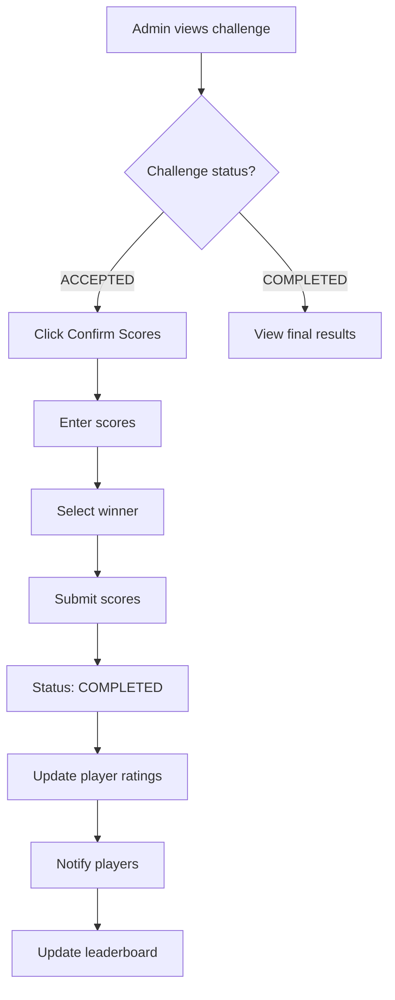
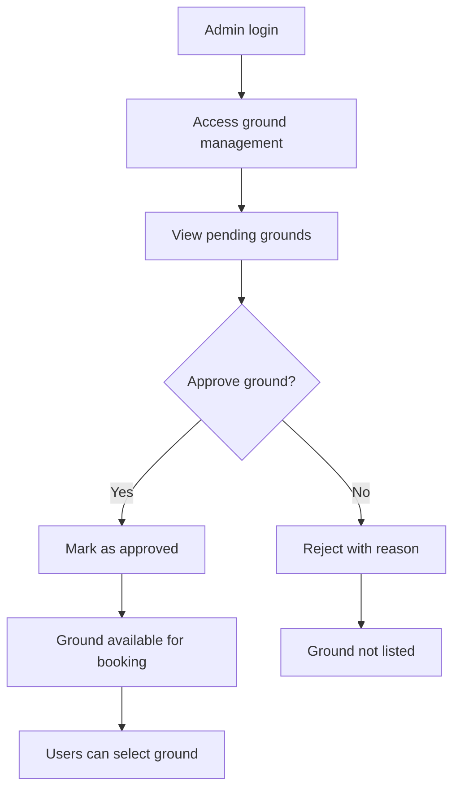
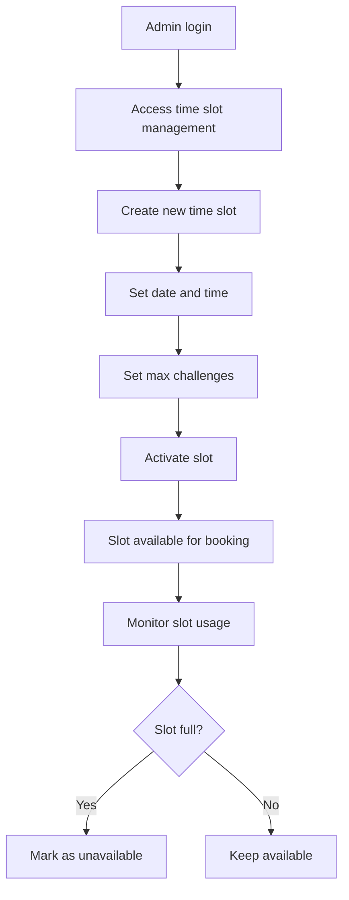

# ChallengeHub - Detailed Workflow Documentation

## 🔄 System Workflows

### 1. User Registration & Onboarding Workflow



**Steps:**
1. User fills registration form (username, email, password, name)
2. System validates form data
3. User account created with default profile
4. User redirected to profile completion page
5. User fills cricket-specific details (role, experience, etc.)
6. Profile marked as complete
7. User gains full platform access

### 2. Challenge Creation Workflow



**Challenge Types:**
- **Batter Challenge**: "I will hit X sixes in this over"
- **Bowler Challenge**: "I won't concede more than X sixes"  
- **Full Challenge**: Both players bat and bowl
- **Open Challenge**: Any player can accept

### 3. Challenge Acceptance Workflow



### 4. Score Confirmation Workflow (Admin)



### 5. Ground Management Workflow (Admin)



### 6. Time Slot Management Workflow (Admin)



## 🎯 User Journey Maps

### New User Journey
1. **Discovery**: User finds the platform and explores features
2. **Registration**: Creates account and completes cricket-specific profile
3. **Exploration**: Browses challenges, grounds, and leaderboard
4. **First Challenge**: Creates or accepts first challenge (with one active challenge restriction)
5. **Engagement**: Participates in multiple challenges and tracks performance
6. **Community**: Becomes active community member with rating and statistics

### Experienced User Journey
1. **Login**: Quick access to dashboard with personalized content
2. **Challenge Management**: Create/accept challenges efficiently with active challenge tracking
3. **Performance Tracking**: Monitor ratings, statistics, and leaderboard position
4. **Social Features**: Interact with other players and view public profiles
5. **Admin Features**: Help manage platform (if admin) with comprehensive tools

## 📊 Data Flow Diagrams

### Challenge Data Flow
```
User Input → Form Validation → Active Challenge Check → Database Storage → Status Update → Notification → Rating Calculation → Leaderboard Update
```

### User Profile Data Flow
```
Registration → Profile Creation → Cricket-Specific Data Validation → Storage → Display → Updates → Statistics Calculation → Performance Tracking
```

### Admin Management Data Flow
```
Admin Action → Permission Check → Data Modification → Database Update → User Notification → System Update → Real-time Updates
```

## 🔐 Security Workflows

### Authentication Flow
1. User provides credentials
2. System validates credentials
3. Session created if valid
4. User redirected to dashboard
5. Session maintained for subsequent requests

### Authorization Flow
1. User attempts action
2. System checks user permissions
3. Action allowed/denied based on role
4. Audit log created for admin actions

### Data Validation Flow
1. User submits form
2. Client-side validation
3. Server-side validation
4. Database constraints check
5. Data stored if valid

## 📱 API Workflow

### REST API Request Flow
```
Client Request → URL Routing → View Processing → Authentication Check → Permission Validation → Business Logic → Database Operation → Response Generation → JSON Response
```

### Error Handling Flow
```
Error Occurs → Error Classification → Logging → User Notification → Recovery Action → System Continuation
```

## 🔄 State Management

### Challenge States
- **OPEN**: Available for acceptance
- **PENDING**: Waiting for opponent response
- **ACCEPTED**: Both players committed
- **COMPLETED**: Match finished with results
- **CANCELLED**: Challenge cancelled

### User States
- **Active**: Can create/accept challenges
- **Suspended**: Limited platform access
- **Banned**: No platform access

### System States
- **Maintenance**: Limited functionality
- **Active**: Full functionality
- **Emergency**: Critical functions only

## 📈 Performance Optimization Workflows

### Database Query Optimization
1. Identify slow queries
2. Add database indexes
3. Optimize query structure
4. Implement caching
5. Monitor performance

### Static File Optimization
1. Collect static files
2. Compress images
3. Minify CSS/JS
4. Implement CDN
5. Cache static content

## 🚀 Deployment Workflow

### Development to Production
1. **Code Review**: Peer review of changes
2. **Testing**: Automated and manual testing
3. **Staging**: Deploy to staging environment
4. **Production**: Deploy to production
5. **Monitoring**: Monitor system health
6. **Rollback**: Quick rollback if issues

### Database Migration Workflow
1. **Backup**: Create database backup
2. **Migration**: Run database migrations
3. **Verification**: Verify data integrity
4. **Rollback Plan**: Prepare rollback if needed
5. **Monitoring**: Monitor system performance

## 🔧 Maintenance Workflows

### Daily Maintenance
- Check system health
- Monitor error logs
- Verify backups
- Update security patches

### Weekly Maintenance
- Performance analysis
- Database optimization
- Security audit
- User feedback review

### Monthly Maintenance
- Full system backup
- Security updates
- Performance review
- Feature planning

## 📊 Monitoring Workflows

### System Health Monitoring
1. **Metrics Collection**: Gather system metrics
2. **Threshold Checking**: Compare against thresholds
3. **Alert Generation**: Generate alerts for issues
4. **Response Action**: Take corrective action
5. **Resolution Tracking**: Track issue resolution

### User Activity Monitoring
1. **Activity Tracking**: Monitor user actions
2. **Pattern Analysis**: Identify usage patterns
3. **Anomaly Detection**: Detect unusual activity
4. **Security Response**: Respond to security threats
5. **Reporting**: Generate activity reports

## 🎯 Success Metrics

### User Engagement Metrics
- Daily active users
- Challenge completion rate
- User retention rate
- Profile completion rate

### System Performance Metrics
- Page load times
- Database query performance
- Error rates
- Uptime percentage

### Business Metrics
- New user registrations
- Challenge creation rate
- Ground utilization
- Admin efficiency

---

This comprehensive workflow documentation provides detailed insights into how the ChallengeHub platform operates, ensuring smooth user experiences and efficient system management.
